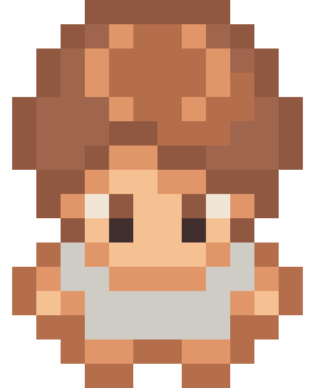
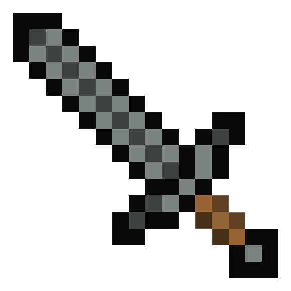

---
layout: profile
search_exclude: true
--- 

    

        
         
        

            <h1 class="centered">Player Stats</h1>

            <h1 id="characterHealth"></h1>
            <h1 id="characterDamage"></h1>
             
            <h1>Equipped Gear</h1>
            

            

        

    

    

        

            <h1>Armor</h1>
        

         
        

            <h1>Weapons</h1>
        

         
        <!-- 
        

            <h1>Accessories</h1>
        
 -->
        
Drop Here to Equip

    

