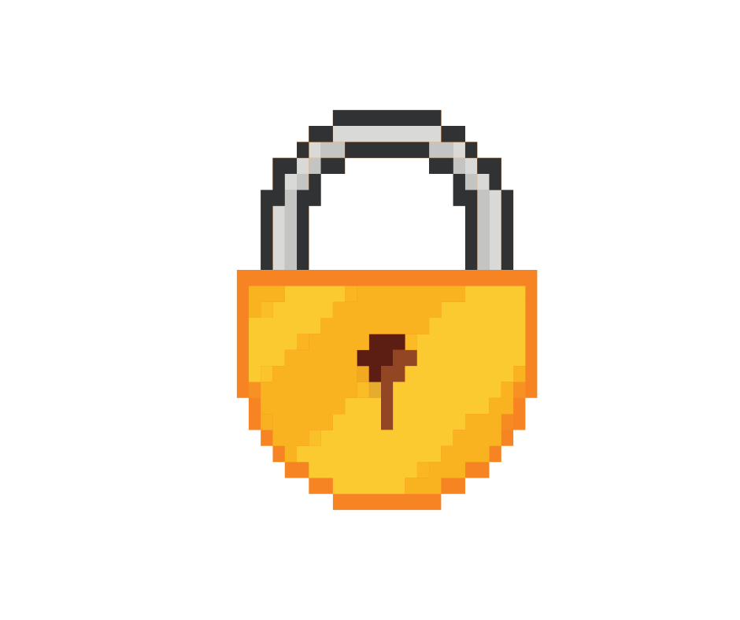

<body>

 
    <h1>Become a Cyber Wizard!</h1>
    <button onclick="goBack()" id="backBtn" class="backBtn">Back</button>
    

        
    

    

        
    

    

        
    

<!-- gravity game modal -->

    

        <link rel="stylesheet" href="gravity_game/gravitystyle.css">
        <body>
            <button class ="closeGBtn" id="closeGModal"> Close </button>
            <canvas id="gameCanvas" width="1200" height="800"></canvas>
            

                <input type="text" id="userInput" placeholder="Type the definition">
                

            

            
        </body>
    

<!-- phishing game modal -->

    

        <link rel="stylesheet" href="phishing_game/phishingstyle.css">
        <button class ="closePhishBtn" id="closePhishModal"> Close </button>
    

<!-- password game modal -->

    

        <link rel="stylesheet" href="password_game/passwordstyle.css">
        <body>
            

                <h2>Password Game</h2>
                 
                <button id="start_button" class="select_button" onclick="startGame()">Start</button>
                

                    <input type="text" id="passwordInput" placeholder="Enter your password">
                      
                    <button id="check_button" class="check_button" onclick="checkPassword()">Check</button>
                    <ul id="requirements">
                        <li id="length">At least 8 characters</li>
                        <li id="uppercase" style="display:none;">At least one uppercase letter</li>
                        <li id="lowercase" style="display:none;">At least one lowercase letter</li>
                        <li id="numbers" style="display:none;">At least one number</li>
                        <li id="specialChars" style="display:none;">At least one special character</li>
                    </ul>
                    
0:00

                    <button id="restart_button" class="restart_button" onclick="restartGame()" style="display:none;">Restart</button>
                

            

            

                

                    &times;
                    <h3>You met all the requirements, your password's:</h3>
                    
-

                    
-

                

            

            
        </body>
        <button class ="closePassBtn" id="closePassModal"> Close </button>
    

</body>

